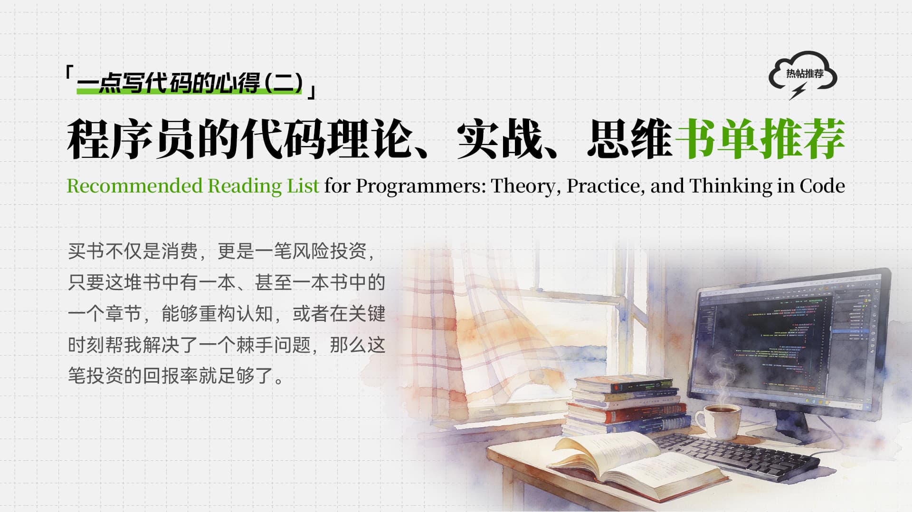

上篇文章发出来之后，抛开我的总结有没有营养不说，文中提到的书单倒是吸引了不少人的好奇。这篇文章就来谈谈书单，写作这回事，就想到哪写到哪吧，毕竟咱也不是专业的。

有前辈疑惑为什么我提的几本关键书籍跟他十几年前读的一样，软件工程这些年没啥进步吗？也有新同学觉得这些都比较抽象、晦涩难懂，有没有一些好懂实操的？

同样的文章同样的书，不同的人读后的感受和理解是不一样的，形成的认知也不一样。我遇到过不少同学都有"读书如抽丝"的困难，但很多时候我们需要去接触更原始的信息，去读他人总结过的，既会有信息的丢失，也会掺杂一些噪声进来。所以在书单之外，也分享下读书这件事。

我是一名典型的 "买书爱好者"，这个爱好深受我老婆的"唾弃"，占地方、易积灰、搬家困难，而且需要一个书房，无形中挤压了我儿子儿童房的空间。但这个爱好一致没被撼动，只是电子书的占比越来越高了~。粗略算来，工作后每年花在买书和专栏上的钱过万，包括纸质书、得到和极客时间上的专栏，肯定是看不完的，"买书如山倒，读书如抽丝"。

但读不完并没有对我造成困扰，也没有阻塞我继续买书的脚步，能读个10%-20%我就挺满意了。在我看来，买书不仅是消费，更是一笔风险投资。只要这堆书中有一本、甚至一本书中的一个章节，能够重构我的认知，或者在关键时刻帮我解决了一个棘手问题，那么这笔投资的回报率就足够了。

# 1、买书的哲学

在这个信息爆炸的时代，我们每天都被碎片化的博客、短视频和公众号推文包围。很多人觉得，知识都在网上，何必买书？但我的体会恰恰相反：信息的获取成本越来越低，但筛选成本却越来越高。

网络上的信息往往是零散的、线性的，甚至是互为噪声的。而书籍，尤其是好书，是作者经过深思熟虑、系统化整理后的低熵体。

买书，本质上是一次不对称的风险投资。一本书不过几十块钱，是一杯咖啡的成本；但如果书里的某一个观点重构了你的认知，或者某一个章节帮你解决了一个生产环境的致命Bug，它的回报率就是成百上千倍。既然是投资，就不能盲目，我的选书哲学大致遵循一套 "点-线-面-体" 的进阶逻辑：

## 1.1 先读"正统"，确立品味的基准线

在计算机行业，技术的更迭周期极短，昨天流行Struts，今天就是Spring Boot，明天可能是Service Mesh。追逐新技术很容易让人焦虑。但是，底层逻辑的"半衰期"是很长的。

所谓的"正统作品"，往往符合林迪效应：一本书已经流传了20年依然被引用，那么它大概率还能再流传20年。学物理要从牛顿定律开始，学绘画要从临摹达芬奇开始，写代码也一样。

读《SICP》（计算机程序的构造和解释）或《人月神话》这样的书，最大的意义在于建立认知的坐标系和度量衡。当你见识过什么是顶级的系统设计，拥有了一把"金尺子"，再去审视市面上那些拼凑的"21天精通XXX"或"XXX从入门到放弃"，你一眼就能看出其含金量。

先拉高品味的上限，你才不会在低质的信息垃圾中浪费生命。

## 1.2 再读"综述"，开启上帝视角

有了品味，还需要地图。很多工程师（包括年轻时的我）容易陷入一个误区：接到任务就钻进代码细节，研究某个API怎么调，如同盲人摸象，只见树木不见森林。

这时候，你需要读一些综述类的作品，比如《计算机系统要素》或者《架构整洁之道》。这类书通常不解决具体的编码问题，但它们能帮你构建一个完整的知识图谱。

阅读它们，就像是打开了Google地图的卫星模式。它能让你清晰地看到：你现在处理的这个模块，在整个计算机科学的宏大版图中处于什么坐标？它与上游的业务、下游的数据库、底层的操作系统是如何交互的？拥有全局视野的工程师，在解决局部问题时，往往能给出降维打击式的方案。

## 1.3 深啃"专著"，在单点上形成穿透力

当你手里有了地图，并确定了当下的痛点或职业方向后，就该拿起钻头搞深挖了。这时候需要的是厚重的专著。

比如你想精通高并发，泛泛而谈的文章没用，你需要去啃《Java并发编程实战》；你想搞懂数据存储，就要去读《数据库系统实现》。

如果说综述书解决的是"广度"，那么专著解决的就是核心竞争力。在软件行业，"知道原理"和"能解决复杂问题"是两个物种。只有通过阅读专著，理解了那些反直觉的设计、那些极端的边界条件，你才能完成从"熟练工"到"专家"的蜕变。

## 1.4 引入"竞争性观点"，进行交叉验证

这是最高阶的玩法，也是我从"信徒"变成"思考者"的关键一步。

技术世界里没有绝对的真理，只有特定场景下的权衡（Trade-off）。为了打破"信息茧房"，针对同一个知识领域，我通常会刻意寻找持有不同观点的书对照着读。你会发现，大师们在顶峰相见，但攀登的路径却截然不同。

**代码设计层面的"神仙打架"**

观点1：Robert C. Martin 在《代码整洁之道》中极力推崇"函数应该极其短小，最好只有几行"，主张通过大量的拆分来让代码像散文一样可读。

观点2：斯坦福教授 John Ousterhout 在《软件设计的哲学》中却提出反对意见，他认为过度的拆分会导致"浅模块"泛滥，增加了认知负担，主张"模块应该深厚"，即接口简单而实现复杂。

把这两本书放在一起，你就会明白：前者是为了解决"逻辑的可读性"，后者是为了解决"接口的易用性"。这就避免了你盲目地把所有函数都拆成碎片，而是根据复杂度来决定拆分粒度。

**工程文化层面的"大厂 vs 游击队"**

观点1：《Google 软件工程》展示了万人级团队如何通过严格的流程、封闭的测试环境和统一的代码库来维持几十年的软件生命力，强调的是稳定性与规模化。

观点2：37signals 的《Rework》（重来）却告诉你：会议是毒药，计划是瞎猜，小团队应该摒弃一切繁文缛节，保持野蛮生长，强调的是效率与创新。

谁对谁错？都对。前者解决的是规模协作的问题，后者解决的是快速交付的问题。读完这两本，你就知道在创业公司搞 Google 那套流程是找死，在巨头企业搞 Rework 那套是作乱。

**架构重心层面的"业务 vs 数据"**

观点1：Eric Evans 的《领域驱动设计》（DDD）告诉你，软件的核心复杂度在于业务逻辑，我们要花大力气去建模业务、划分界限上下文，防止业务逻辑腐烂。

观点2：Martin Kleppmann 的《数据密集型应用系统设计》（DDIA）则提醒你，现代系统的挑战往往在于数据的流动、一致性和分区容错，架构师要懂数据库的底层原理，防止数据系统崩塌。

这两本书互为补充，构成了架构师的"双核"——左脑处理业务复杂度（Logic），右脑处理技术复杂度（State）。

正是这些矛盾、冲突和侧重不同的地方，才是技术最精彩的部分，也是你独立思考的起点。这种交叉验证能让你跳出对某个权威的盲从，学会根据自己所处的具体环境（Context），选择最合适的兵器。

# 2、读书的方法

很多人"买书如山倒"，是因为潜意识里有一种"买了就是会了"的安慰剂效应；而"读书如抽丝"，则是因为被学生时代的习惯所困，觉得必须从第一页读到最后一页才算读完。

在信息论（通信专业毕业生小秀一下）中说，阅读的本质是解码。面对不同压缩率和信噪比的书籍，如果你只用一种线性的阅读算法，效率必然低下。不仅要读，更要懂得 "不读"。对于软件开发相关书籍，我大概有以下四种不同层级的阅读方式：

## 2.1 先看"地图"，别急着赶路

拿到一本新书，绝对不要一上来就看正文。先花30分钟给它做个 "体检"。

你要看目录、看序言、看结尾。目录就是作者给你的地图，序言是作者告诉你这书解决什么问题。通过这一步，你要做一个重要的决定：这书是值得我花一个月去通读？还是只配放在书架上查阅？或者是本烂书，直接扔掉？

**举个例子：《计算机程序设计艺术》（TAOCP）**

这是高纳德写的巨著，号称计算机界的"九阴真经"。如果你傻乎乎地从第一页开始读，我保证你在第二章之前就会放弃。

聪明的读法是：翻翻目录，哇，原来它讲了这么多算法；看看序言，理解大神对算法的严谨态度。然后，把它合上。你知道这是一座金矿，也知道入口在哪，这就够了。以后当你真的需要研究某个极偏僻的算法时，你知道去书架的哪里把它抽出来。

如果目录逻辑混乱，或者序言不知所云，大概率这本书不值得投入时间。

## 2.2 只挑你现在最需要的读

这是大多数技术书的正确打开方式。就像去吃自助餐，你不需要把所有菜都吃一遍，你只想吃你现在最想吃的那块肉。

技术书通常都是非线性的。当你遇到一个Bug、或者要搞定一个功能时，带着这个问题，直接跳到那一章去读。这时候你的注意力最集中，学得最快。

**举个例子：《Java并发编程实战》**

假设你现在的生产环境出了一个死锁Bug，火烧眉毛了。这时候，千万别去读第一章"线程的历史"。

直接翻到第10章"避免活跃性危险"。你带着"怎么解锁"的问题，去看书中讲的"锁顺序死锁"。读完这一章，代码改好了，Bug解了，这本书现在的任务就完成了。这种"急用先学"的方法，看似零散，其实记得最牢。

## 2.3 逐字逐句地精读

这种最高礼遇，只留给那前5%的经典"神书"。当一本书颠覆了你的认知，或者让你拍大腿说"原来是这样"，那就慢下来，一个字一个字地啃。

这时候不仅要看懂字面意思，还要想：作者为什么这么想？如果是我，我会怎么设计？这就像是在和大师下棋，模仿他的思维。

**举个例子：《数据密集型应用系统设计》（DDIA）**

读这本书，你不能跳。作者在讲分布式系统的坑时，逻辑是一环扣一环的。

你必须跟着他的思路去推演：如果网络断了数据会怎么丢？如果时钟不准了事务会怎么乱？读这种书非常烧脑，可能一天只能读5页，但别急，这5页给你增加的内功，抵得上读5本普通的"21天速成"。这是在重塑你的大脑底层。

## 2.4 当作"外挂"，不用背下来，放在手边就好

人的记性是有限的，不要试图把书里的代码都背下来。要把书架当成你的"外挂硬盘"。

读完的书，要分个类：常用的工具书、经典书，放在书架最显眼、伸手就能拿到的地方；过时的书，收进箱子。你需要的时候，一伸手就能拿到它，这就是最好的状态。

**举个例子：《代码大全 2》（Code Complete）**

这本900多页的大砖头，里面全是关于变量命名、调试技巧的细节。你不需要背诵它。

你只需要把它放在显示器旁边。当你写代码感觉"味道不对"，或者不知道怎么给一个复杂的函数起名时，伸手把它拿过来，翻到对应章节找灵感。它不是教材，它是你的字典，是你的外挂。

# 3、程序员的书单

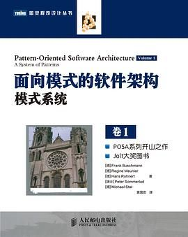

这份书单算是我拿钱筛选出来的，也是我从写代码到带团队，一路摸爬滚打后觉得挺有用的。都买了纸质版，不一定都精读完了，但肯定不是翻完就扔的。当然有其局限性，主要基于我个人的后端与架构视角，但其中的底层逻辑和工程思想，应该都是通用的。

按我的理解大致分了下层次，再往后深入的就没涉猎过了，这套书之后转读团队管理相关的了。不算全面，但都算得上经得起时间考验的"经典"和能解决具体痛点的"实战"书籍吧。

## 3.1 理论基石：计算机科学原理

这一层是内功。地基打得深，高楼才能起得稳。这些书虽然枯燥，但越到底层，技术越不容易过时。

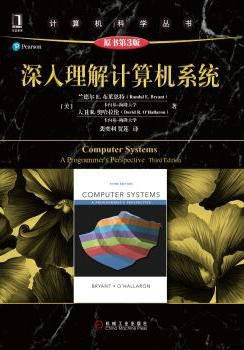
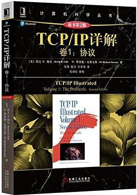
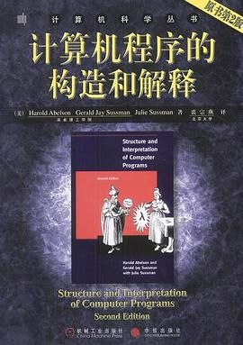
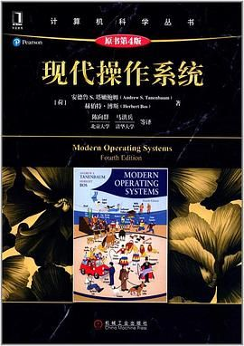
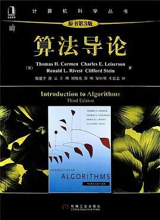

- **《深入理解计算机系统》（CSAPP）**：计算机科学领域的"九阳神功"。打通了计算机组成原理、操作系统、网络和编译器的任督二脉。建议配合CMU的公开课视频和Lab实验一起做。
- **《TCP/IP详解 卷1：协议》**：互联网世界的"交通法规"。详细剖析了网络协议栈的每一层。建议打开Wireshark抓包工具对照阅读。
- **《计算机程序的构造和解释》（SICP）**：被称为MIT的"魔法书"。教的是计算的本质——抽象与组合。非常烧脑，建议做习题。
- **《现代操作系统》**：操作系统是软件运行的舞台。重点关注进程管理、内存管理和文件系统部分。
- **《算法导论》**：算法领域的"珠穆朗玛峰"。不要试图从头读到尾，把它当字典查阅。

## 3.2 核心技法：编程语言与实战

熟练掌握手中的兵器。这一层不仅要会用语言，更要懂语言的设计哲学。

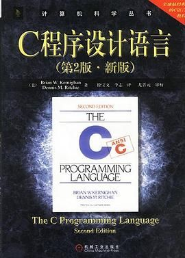
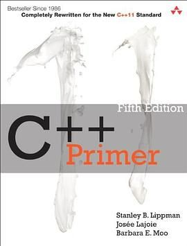
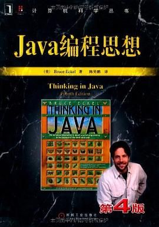
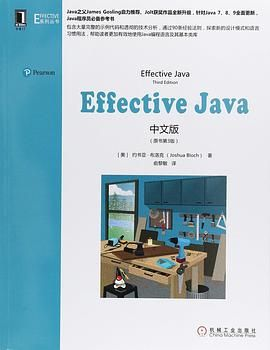
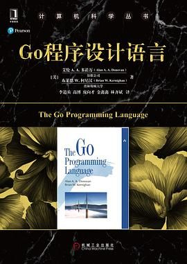
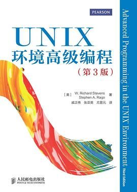
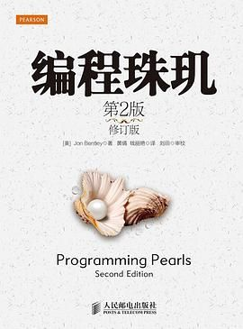

- **《C程序设计语言》（K&R）**：C语言之父的经典之作，薄薄一本，字字珠玑。
- **《C++ Primer》**：征服C++的百科全书。非常全面且与时俱进。
- **《Java编程思想》**：试图解释Java"世界观"的书。把面向对象的精髓讲得入木三分。
- **《Effective Java》**：Java开发者的避坑指南。由几十条独立的"最佳实践"组成。
- **《Go程序设计语言》**：云原生时代的C语言圣经。重点理解Channel和Goroutine的设计模式。
- **《Unix环境高级编程》（APUE）**：Linux/Unix开发者的枕边书。连接了你的应用程序和操作系统内核。
- **《编程珠玑》**：讲的不是语法，而是解决问题的"巧劲"和"智慧"。

## 3.3 代码修养：规范、模式与重构

代码是写给人看的，顺便给机器运行。这一层关乎职业尊严和团队协作。

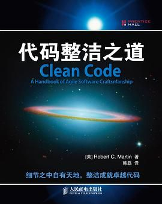
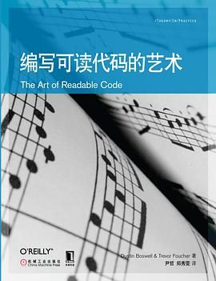
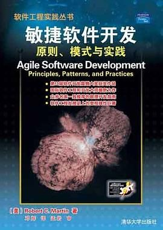
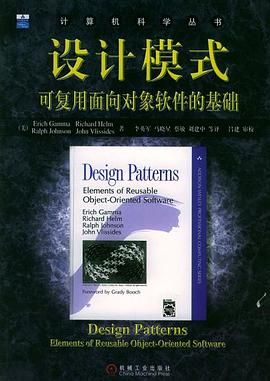
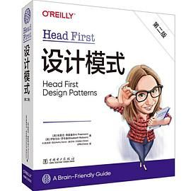
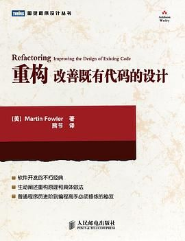
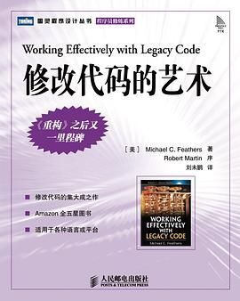
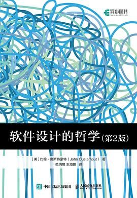

- **《代码整洁之道》（Clean Code）**：定义了什么是业界的"好代码"。建议在团队内组织读书会。
- **《编写可读代码的艺术》**：轻量级的实战手册。非常接地气。
- **《敏捷软件开发：原则、模式与实践》**：详细阐述了SOLID五大设计原则。
- **《设计模式》（GoF）**：总结了23种通用的设计解决方案，是工程师之间的通用语言。
- **《Head First 设计模式》**：最不像技术书的技术书。如果你觉得GoF那本太难啃，这是最好的替代品。
- **《重构》**：对抗代码腐烂的神器。提供了安全的"手术刀"。
- **《修改代码的艺术》**：遗留系统的救命稻草。
- **《软件设计的哲学》**：敢于挑战《Clean Code》权威的好书。建议对比阅读。

## 3.4 架构思维：系统设计与演进

架构师的核心能力是权衡（Trade-off）。这一层需要宏观视野，既要懂技术，又要懂业务。

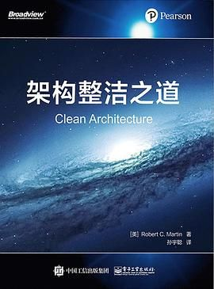
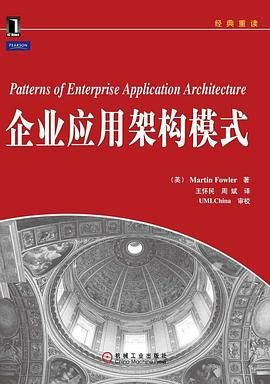
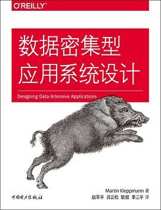
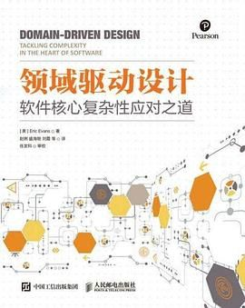
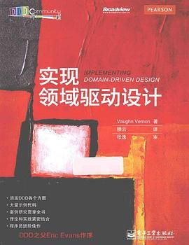
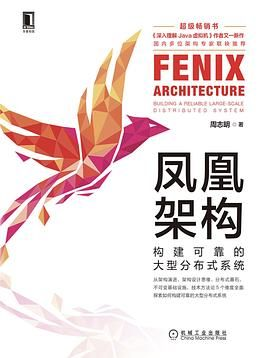
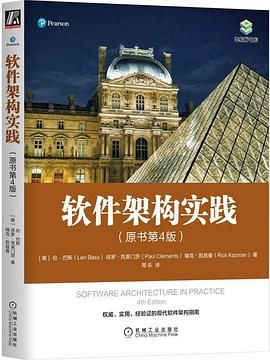
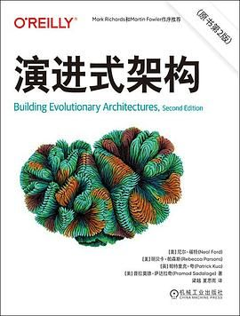
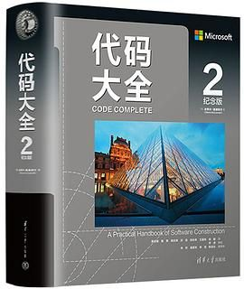

- **《架构整洁之道》**：Uncle Bob在架构领域的集大成之作。揭示了架构的本质是管理"依赖关系"。
- **《企业应用架构模式》**：我们今天使用的绝大多数Web开发模式都是这本书定义的。
- **《数据密集型应用系统设计》（DDIA）**：近十年后台技术领域公认的"神书"。极度精读。
- **《面向模式的软件架构》**：系统和组件层面的模式。帮你建立架构的"大局观"。
- **《领域驱动设计》（DDD）**：解决复杂业务逻辑的终极利器。微服务划分边界最重要的理论依据。
- **《实现领域驱动设计》**：DDD最好的落地指南（"红皮书"）。
- **《凤凰架构》**：面向未来的架构书。从单体到微服务到云原生的技术脉络。
- **《软件架构实践》**：强调架构是对质量属性的管理。让你的架构设计从"凭感觉"走向"有理有据"。
- **《演进式架构》**：提出了"适应度函数"的概念。颠覆了传统"预先设计好一切"的观点。

## 3.5 工程视野：流程、协作与管理

写代码是个人的事，做软件是团队的事。这一层关于流程、协作与人性。

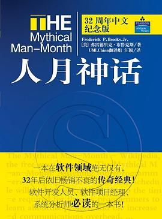
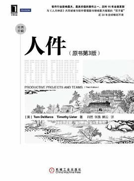
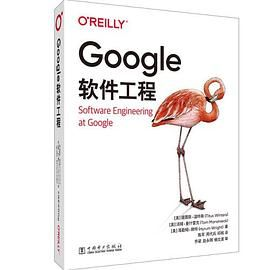
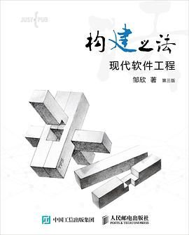
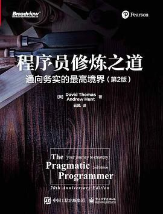

- **《代码大全2》**：软件构建领域的百科全书。可以伴随你整个职业生涯的案头书。
- **《人月神话》**：软件工程界的"史记"，出版50年依然不过时。"向滞后的软件项目增加人手，只会让它更滞后"。
- **《人件》**：指出软件开发本质上是社会学活动。教你保护团队的"流（Flow）"状态。
- **《Google软件工程》**：区分了"编程"和"软件工程"。揭秘了Google如何做Code Review、测试和知识管理。
- **《构建之法》**：非常接地气的软件工程教材。文风幽默。

## 3.6 认知觉醒：职业素养与软技能

技术在变，但思维模型不变。这一层助你跳出代码，提升职业高度和认知格局。

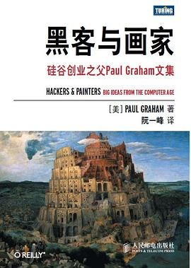

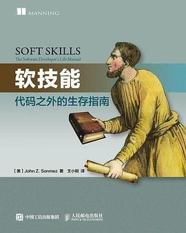
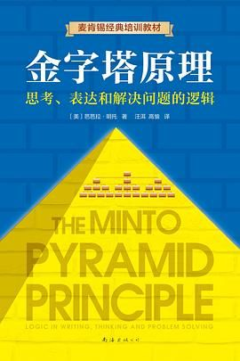

- **《程序员修炼之道》**：程序员的职业生涯指南针。DRY、曳光弹开发、每年学习一种新语言。
- **《黑客与画家》**：硅谷创业教父的文集。编程不仅仅是谋生手段，更是改变世界的工具。
- **《设计心理学》**：跳出代码看产品。培养你的同理心。
- **《软技能》**：程序员的"人生操作手册"。涵盖职业规划、理财投资、健身甚至恋爱。
- **《金字塔原理》**：清晰表达和逻辑思维的必修课。"结论先行、以上统下"。

# 4、总结

回到文章开头提到的那个"买书如山倒"的梗。

很多时候，看着书架上那些还没有拆封的塑料膜，我也会有一丝焦虑。但纳西姆·塔勒布在《黑天鹅》里提到的 "反图书馆" 概念释怀了我：很多时候，没读过的书比读过的书更有价值。

读过的书是你的"已路过"，而没读过的书则是你的"未可知"。书架上那些沉默的未读书籍，时刻在提醒着我的匮乏，提醒着在这个浩瀚的计算机科学领域，我所掌握的不过是沧海一粟。说到这我又想起了乔布斯那句 "Stay Hungry, Stay Foolish"。

当然，这份书单仅是我个人在技术丛林中摸索出的一张探险地图，它注定是不完整的，也不可避免地带有我个人的偏见与局限。买书能缓解我的焦虑，读书能提升我的能量，可能这是I人的一种解压方式吧。

编程是与机器的对话，而读书是与大师的对话。愿你的书架永远拥挤，那里藏着你对世界的好奇；愿你的认知边界永远在扩张，那里通向你未来的自由。

---

**更多内容：**

- [一点写代码的心得（一）：AI 时代 Coding 还重要吗？](https://www.chaspark.com/#/hotspots/1219001803137515520)
- [一点写代码的心得（三）："你可别再重构了！"](https://www.chaspark.com/#/hotspots/1229662331782266880)
