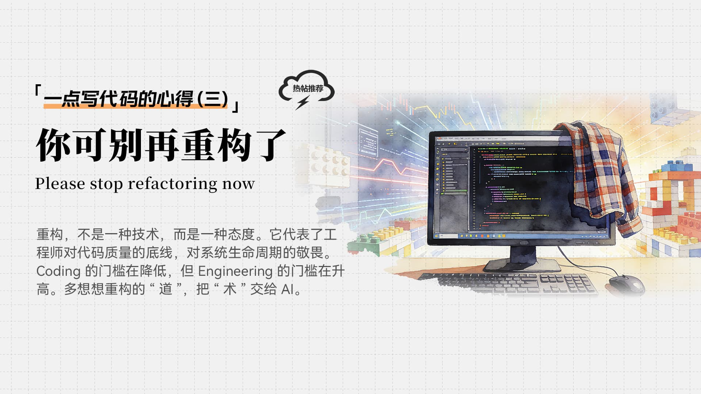
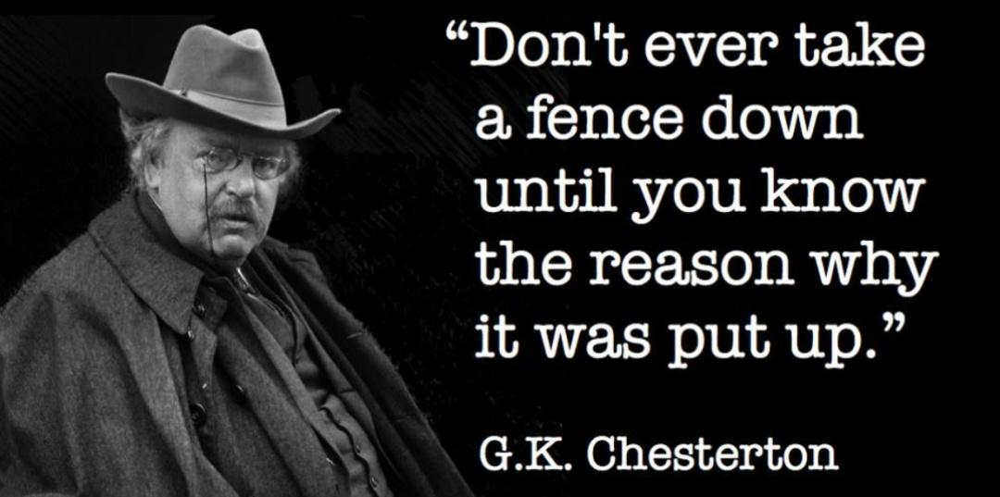
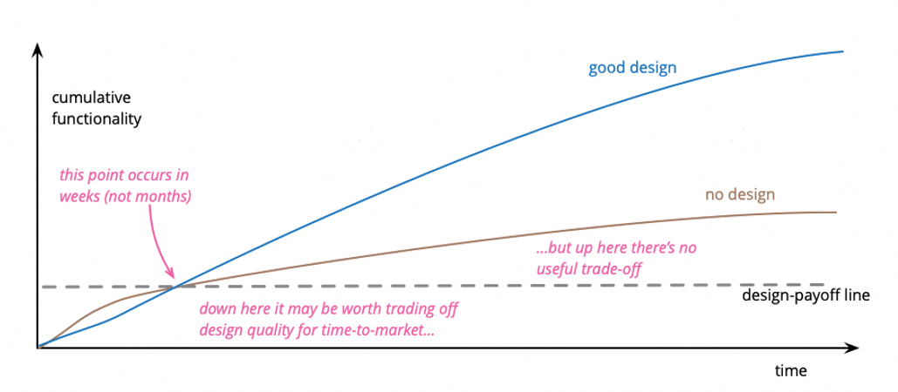
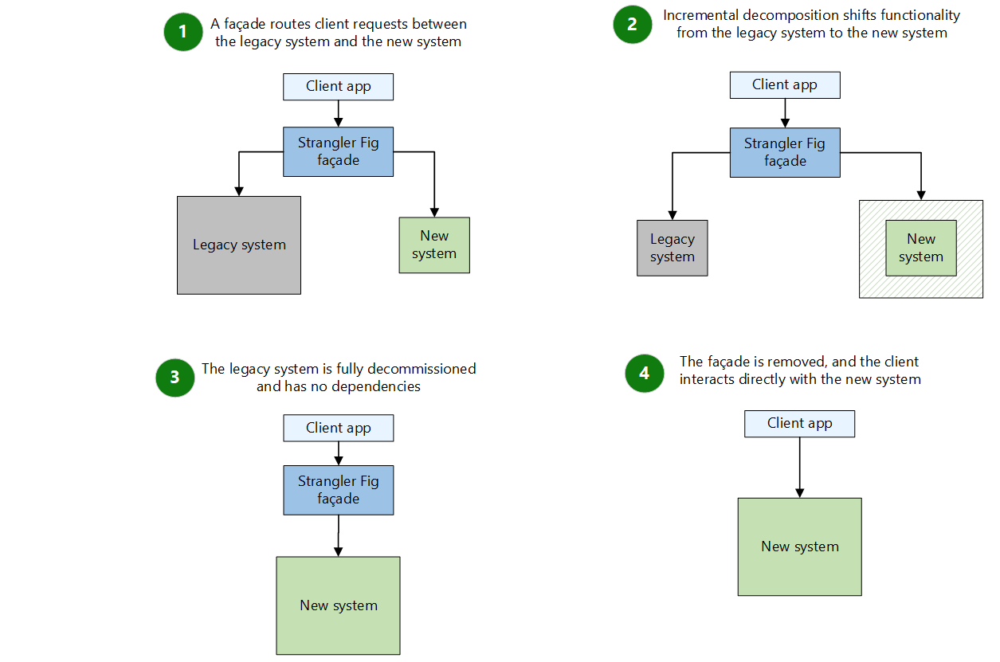
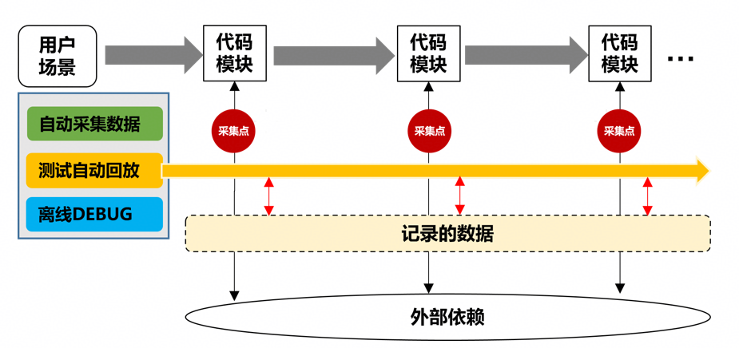

[引言]

"你可不能像以前一样搞那么多重构了，要是引入问题了，就是生命安全的大事。"

前几天，跟一位一起转到新业务的老同事散步，他这句半开玩笑的"警告"，让我愣了很久。若是放在六年前，刚入职那会儿，听到这话我肯定嗤之以鼻：作为一名追求卓越的软件工程师，看到如"大泥球"般的代码而不动，难道不是失职吗？

上篇文章[AI 时代Coding还重要吗？](https://www.chaspark.com/#/hotspots/1219001803137515520)中瞎扯了下写代码的心得，Vibe Coding肯定会越来越成熟，看着 Cursor 这样的 AI 工具让重构变得前所未有的容易，我反倒越来越"胆小"了。

提到重构，肯定会想到《重构：改善既有代码的设计》这本书，其对重构的定义一直被引用，重构的原则、代码的坏味道、以及篇幅最多的重构手法都讲的很清楚。重构也经常被软件主管、CMC主任惦记，每年软件类重点工作的规划中多少都有点。

再谈重构又能谈点啥呢，重构已经是广为接受的软件实践，看起来一切都挺好。但是"道理我都懂，就是过不好这一生"的事情反复在发生。

我见过有团队因重构引入一批问题，所谓的"好心干坏事"之后，对重构失去信心的；

我见过 CMC 年初规划的重构，因为项目交付冲突，基本都没落地的；

也见过有同学在没有测试防护网的前提下裸奔重构，代码不敢上库的。

"重构"好像只是一块漂亮的招牌，挂在嘴边很香，吃进嘴里却容易崩了牙。今天，就聊聊我在实战中看到的重构吧。

# 1. 重构的经历与教训

在物理学中，热力学第二定律告诉我们：在一个封闭系统中，熵（混乱度）总是趋向于增加的。除非你引入外部能量做功，否则系统终将走向寂灭。

软件系统也是如此。每一次需求的变更，每一次紧急的 Bug 修复，每一行为了赶进度而写死的 if-else，都是在向这个系统注入"混乱"。而重构，本质上就是我们为了对抗这种"熵增"所做的功，是维持软件生命力的必要手段。

## 1.1 三十万行代码的"血与火"

我的重构之路，是从 2019 年开始的。那时刚入职，恰逢公司推行软件工程能力变革。

我的起手式很轻，当时交付的第一个需求涉及大约一千行代码的改动——把一个功能模块从 C++ 重写为 JAVA。有人会质疑：这叫重写（Rewrite），不叫重构（Refactoring）吧？

其实，这取决于我们观察的颗粒度。如果把观察对象定为某个具体的函数，代码全变了，那确实是重写；但如果把观察对象定为这个模块整体，它对外的接口契约没变，输入输出行为没变，完全符合 Martin Fowler 关于重构的定义——"在不改变代码外在行为的前提下，对代码做出修改"。所以，我们大可不必在名词解释上纠结。

那时我觉得重构很简单：把已有的功能重新实现一遍，换个更优的方式，既有参照物，又不用从零设计，简直是"降维打击"。看着 IDE 里的绿灯亮起，心里充满了将混乱理顺的快感。

但真正的挑战发生在两年后。

团队立项做大规模的架构重构，背景是两个大型软件产品的合并。那是一场灾难般的"熵增"现场：两套架构、两种风格、两拨人的思维碰撞。我深度参与其中，从最开始跟着软件教练写代码，到后来成为新架构下的团队负责人，这一干就是 4 年，累计翻新了近 30 万行代码。

在这个过程中，我经历了过山车般的跌宕。

高光时刻：在技术攻关期间，因为对老架构的拆解和新架构的搭建做出了贡献，我的技术能力得到了广泛认可。

至暗时刻：因新架构正式切换上网后，初期质量波动大，现网问题频发。作为团队负责人，那一年的绩效凉凉。

对于一个曾经心高气傲的技术人来说，这无异于当头一棒。但也驱使我从单纯的"代码洁癖"走向了成熟的"工程思维"。我开始从代码理想乡回到现实泥潭，建立质量看护体系，推行微重构机制，一步步把坑填平。最终，这套架构挺过来了，成为了公认的高质量特性。

## 1.2 那些年踩过的坑

回首这段经历，我发现最大的教训往往不是技术层面的，而是认知层面的。

**陷阱一：你真的清楚系统的行为吗？**

这 30 万行代码的重构，最难的不是修改代码本身，而是弄懂系统的行为。Martin Fowler 对重构的定义前提是"不改变代码外在行为"，但如果你连被重构对象原本的行为是什么都说不清楚，又何谈"不改变"？

面对一个近 20 年的遗留系统，我们面临的往往是"三无"困境：没有系统性的文档，原始的需求早已不可考，最早那批写下核心逻辑的"上帝们"也早已离职。此时的阅读代码，与其说是工程作业，不如说是"数字考古"。每一行过时的注释可能都是误导，唯一的"真理"只剩下那堆运行在现网、逻辑盘根错节的源码。

更可怕的，是那些"隐式行为"。

切斯特顿曾说过一句极富哲理的话："在不知道一个栅栏是为了阻挡什么之前，永远不要拆掉它。"

代码中不仅有显式的接口定义（入参、出参），还有大量的"隐式契约"。

比如函数返回前有个 Thread.sleep(5)，年轻程序员觉得这是"随意"，顺手把它优化掉了。结果上线后发现，那是为了规避某某奇怪的时序问题，让这个线程慢点返回。

比如一段看似多余的 try-catch，你觉得用错误码替代更优雅。结果上游恰恰依赖这个特定异常来触发事务回滚，你的"规范化"直接导致了数据不一致。

这些代码写得丑吗？丑。但它们是系统在多年演进中与现实世界妥协的产物。

甚至有些明显的 Bug，是因为系统中存在另一个 Bug 恰好抵消了它（负负得正）才得以幸存。若未窥全貌就在重构中随手"修正"，往往会打破这种脆弱的平衡，得到令人沮丧的结果。

**没有理解业务全貌和历史背景的"美学重构"，往往是灾难的开始。**"不改变代码外在行为"说起来容易做起来难。

**陷阱二：被低估的"测试防护网"**

重构最大的阻力，除了盯着进度的项目经理，就是那张破破烂烂甚至根本不存在的"测试防护网"。

各种软件工程经典都在强调：高质量的自动化测试是重构的前提。道理谁都懂，但落地时却全是借口。面对一个有着 20 年历史、依赖了七八个外部服务、连 DB 都没有 Mock 的老系统，可能只是想重命名一个函数，或者提取一段几十行的逻辑。如果按标准流程先补齐测试，也许要花三天去搭建环境、写 Mock 对象。

这时候，心中的天平就会倾斜："补齐防护网的代价是重构收益的 N 倍，没必要吧？我就改个名，逻辑没变。"

另一种陷阱来自于"专家的傲慢"。很多自信的程序员（见过不少，也包括当年的我），觉得这块代码逻辑我倒背如流，所有的边缘条件都在我脑子里，写测试用例纯属浪费时间的教条主义。

于是，绝大多数的重构，其实是在"裸奔"。

现实往往是残酷的，那些我们当时不愿付出的代价（编写测试的时间），最终会在转测阶段以数倍的成本"加倍奉还"。时间最终证明，没有人的大脑能比自动化脚本更周到、更持久。自信的程序员也会疲惫、会遗忘，但测试用例不会。

**没有有效测试覆盖的代码，就是不可重构的代码。**在动手修改之前，第一件事不是改代码，而是补充能真正捕获错误的测试用例。

**陷阱三：被忽视的"数据引力"**

这是那次大型重构中排在第三的痛点，也是新架构正式切换上网后，引发现网问题最多的深坑。

在面向对象的世界里，我们太容易"自嗨"了。我们习惯了在内存的乌托邦里操作对象，觉得类设计不合理，反手就是一个属性重命名、方法拆分、类合并。我们看着重构后清爽、高内聚的领域模型沾沾自喜，并据此设计了完美的数据库新表结构。

当时的设想非常"线性"：代码改好了，上线前写个脚本，一次性把旧表数据洗进新表不就完事了吗？

殊不知，代码是轻盈的，但数据是沉重的。

我们初期忽视了细致的数据血缘分析。代码结构变了，数据的存储维度也变了。为了凑齐新模型里一张看似简单的表，我们可能需要去 10 张毫无外键约束的历史旧表里"打捞"字段。这种忽视导致了灾难性的后果：原先预估的 X 人月迁移工作量，随着细节的挖掘，像滚雪球一样变成了之前的10倍。整个项目进度差点被数据迁移这一项拖垮。

但工作量激增还不是最坑的，毕竟承认错误、加班加点，进度总是能追回来的。更坑的是，我们基于"旧数据是正确的、完整的"这一完美假设去设计迁移逻辑。

然而，现网真实的运行环境是残酷的"废土风格"。数据可能是残缺的、重复的、甚至逻辑互斥的。不必怀疑，老系统之所以能跑，是因为它学会了"带病生存"。它容忍了数据的残缺，靠着各种硬编码的补丁维持运行，没病它也不会沦落到要被重构的地步。

但重构后的新代码，往往逻辑严密，眼里揉不得沙子。当我们把这些有着莫名其妙规律的"脏数据"，硬塞进新系统严丝合缝的逻辑里时，灾难发生了。你不知道数据异常的规律，也定位不出异常的原因，结果就是迁移后的数据在内存中从一开始就是错的，直接导致程序逻辑跑飞，抛出各种预料之外的异常。

**代码与数据必须同步演进。**任何涉及持久化的重构，必须把"数据清洗与迁移"的成本作为第一评估要素。重构不只是修改代码，更是数据的一场艰难迁徙。

**陷阱四：带错帽子**

软件开发大师 Kent Beck 曾提出过著名的"两顶帽子"比喻，这是重构纪律的核心：

添加功能帽：目标是让新特性跑起来。你只加代码，不改既有结构（前提是先加测试）。

重构帽：目标是优化结构。你只改结构，不加任何新功能（测试必须保持全绿）。

但在实战中，我们（尤其是那些有代码洁癖的工程师）最容易犯的错误就是"顺手牵羊"。

本来任务只是修一个简单的 Bug，结果定位代码时看到旁边有个函数写得巨丑，甚至还有魔法数字。心中的"正义感"瞬间爆棚："反正都要改这块文件，不如顺手把它优化了吧。"或者在做新需求时，发现老架构很难扩展，忍不住一边写业务逻辑，一边把老架构也给拆了。

这种"混合双打"的结果往往是灾难性的：测试挂了。

此刻你陷入了进退维谷的境地：到底是新写的业务逻辑不对，还是刚才那把"顺手"的重构破坏了原有的隐式契约？你根本分不清。如果是重构导致的，你甚至不敢回退，因为新写的业务代码也混在一起。最终，为了赶进度，你只能含泪把所有修改全部 Revert，一晚上的心血付诸东流。

当然，如果测试防护网是缺失的，结果可能更惨。

**一次只戴一顶帽子。**遵循"原子提交"原则。修 Bug 就是修 Bug，重构就是重构，哪怕它们修改的是同一个文件，也必须分成两个 Commit，甚至两个 MR 提交。

**陷阱五：无法量化的价值**

在很长一段时间里，我推行的"微重构"在项目组里备受冷遇。

工程师和项目经理（PM）仿佛生活在两个平行宇宙。工程师看到的是代码的坏味道、耦合的风险、扩展性的缺失；而 PM 看到的是进度条、特性交付表、用户价值。当工程师提议要对某块代码动刀时，PM 的灵魂拷问总是如期而至："这东西对用户有什么价值？能带来新特性吗？如果不能，为什么要占用两周开发时间？"

如果试图用"代码整洁之道"、"设计模式"、"长远的可维护性"去解释，但在背负着交付压力的 PM 眼里，这些词汇听起来就像是程序员在搞"技术自嗨"——为了满足自己的洁癖而浪费公司的资源。

后来，我学乖了。我不再把"重构"挂在嘴边。

在做年度规划时，我将"微重构"改名为"薄弱模块治理"，并挂上了量化指标："将该模块的千行代码缺陷率（Defects/KLOC）降低 50%"。结果神奇的事情发生了：这个项目广受好评，资源也要到了。

敏锐的你肯定发现了，严格来说，这已经不算是单纯的"重构"了。重构的教科书定义是"不改变外在行为"，而缺陷治理显然是在"修正错误行为"。理论上它们井水不犯河水：重构不直接提升外部质量，修 Bug 也不一定非要动架构。

但现实系统的复杂性在于，很多顽固的"沉疴"，根源往往藏在水下的架构设计里。

重构改善内部设计，外部质量的稳固，强依赖于内部设计的清晰。这个时候我们就给重构找到了可以借的势，当然，要谨防上面的"缺陷四"，一次只干一件事。

**重构需要"翻译"，更需要"借势"。**如果无法量化收益，那说明这个重构也许真的不急着做；或者说明你还没想清楚，这次重构到底是为了解决什么真正的痛点。

# 2. 重构的动机和时机

上一节提到的"治理薄弱模块"，就是大家常说的"还技术债"，是重构的动机之一。

债是肯定要还的，但什么时候还？这不仅是技术问题，更是一门关于时间的艺术。在敏捷开发的理想国里，重构应该像呼吸一样，随时随地都在发生；但在悬着 Deadline 的现实项目中，如果此时此刻你还在悠哉游哉地从头梳理代码，项目经理恐怕要提刀来见了。

根据自己踩过的坑以及带团队的实战经验，重构的落地，最好和版本计划匹配。落地重构最好的时机，往往是在一个版本的"开局"。如果一个版本规划了三个迭代，那么重构的黄金窗口就在迭代 1，甚至我们要想办法人为创造一个"迭代 0"。

为什么要赶早？道理很简单：用空间换时间。越早落地，代码变动带来的震荡就越早平息，留给测试发现回归问题的时间窗口就越长，与后期海量业务需求冲突的概率也就越低。

关于重构的动机和时机，《重构》里有经典的解释，简单总结下。

## 2.1 重构的动机（为何重构）

**第一，为了"止损"，对抗软件的熵增。**你肯定有这种体会：随着需求不断的叠加，代码结构会不可避免地流失。如果不进行维护，代码就会像没人打扫的房间，从整洁变得无序，最后变成垃圾场。重构就是定期的"大扫除"，通过改进设计，让代码回到有序的状态，确保逻辑依然在我们的掌控之中。

**第二，为了"给人看"，降低认知成本。**计算机并不在乎你的代码写得漂不漂亮，只要语法正确，它就能跑。但维护代码的是人（可能是三个月后的你自己，也可能是你的接班人）。Martin Fowler 说过一句名言："任何傻瓜都能写出计算机能理解的代码，优秀的程序员通过重构，写出人能理解的代码。"重构能让代码意图清晰，让别人接手时少掉几根头发。

**第三，也是最反直觉的一点：为了"快"。**很多管理者（甚至程序员自己）认为重构会拖慢进度。但《重构》提出了一个"设计耐久性假说"：如果不重构，初期开发可能很快，但随着代码腐化，添加新功能会越来越慢，直到寸步难行；而良好的重构习惯，虽然初期投入了一点时间，但能让增加新功能始终保持在一条平滑的曲线上。我们重构，不是因为我们有洁癖，而是因为我们想在未来跑得更快。

## 2.2 重构的时机（何时重构）

Fowler 坚决反对专门划拨两周时间来进行"重构冲刺"，他认为重构应该像呼吸一样，融入到日常开发的每一个小时里。

**如果你要增加新功能，发现很难下手，那就是"预备性重构"的时机。**这就像你要开车去一个地方，发现路况极差全是坑。你可以选择颠簸着开过去（硬写代码），也可以选择先花点时间把坑填平，然后再一脚油门踩过去。Fowler 建议："先让改变变得容易（这可能很难），然后再进行容易的改变。"这种磨刀不误砍柴工的策略，是最高效的。

**如果你在阅读代码，发现看不懂，那就是"理解性重构"的时机。**当你为了修 Bug 或加功能去读一段老代码，发现必须捏着鼻子才能读下去时，不要只是在脑子里骂一句。试着改改变量名，拆分一下长函数。这一刻，重构不是为了提交代码，而是为了辅助你的大脑去理解逻辑。一旦你理解了，代码也就顺手被改好了。

**如果你只是路过，发现有垃圾，那就是"捡垃圾式重构"的时机。**这就好比著名的"童子军军规"：离开营地时，要比你来的时候更干净。如果你看到一个明显的坏味道（比如一个重复的逻辑，或者一个莫名其妙的魔法数字），在不影响你当前任务的前提下，顺手把它改了。

当然，还有一个最朴素的"事不过三"原则。第一次做某件事，只管去做；第二次做类似的事，虽然有点反感，但还是照样做了；第三次再做类似的事，别犹豫，马上重构它。

## 2.3 退一步的现实打法

书本的理论是美好的，但现实是骨感的。结合我自己踩过的坑，我觉得在实际开发中，我们还需根据重构动机的"重量"，来选择不同的出手时机。

**首先是那些伤筋动骨的"大手术"。**

比如你要治理一个历史遗留的深坑，或者升级一个核心中间件，甚至要解耦一个巨型的单体模块。这种级别的重构，风险极高，我的建议是：抢占"迭代 0"。

版本（IPD流程）后期是需求交付和修 Bug 的高峰期，代码提交频繁得像股市行情一样，这时候做大重构，光是解决代码合并冲突就能让你怀疑人生。而且，大手术必然伴随大风险，如果在迭代 1 就完成，我们还有整整两个迭代加转测期来发现那些隐蔽的回归问题。如果拖到最后，一旦出事，唯一的选择就是回滚，前功尽弃。

**失败案例**

记得有一次我们做一个EOSOO（传送的一种业务类型）的重构，它依赖EOS和EOO，而这两是非常活跃的模块，重构时机选在了需求批量交付的同时。

我安排了2个骨干独立做这个事，前期做了很充分的分析设计，当MR提出来的时候，发现和不少业务需求的MR冲突了，不太靠谱的合入后，也引发了不少后端问题，饱受诟病。

学乖了之后，我通常会在上一个版本结束后的空窗期（比如春节前后、版本休整期），就安排骨干进行预研和核心代码的修改，等新版本一立项（从上个版本的TR5拉分支），立刻合入，做"技术抢跑"。

为确保落地，我会把这几名骨干独立出来成立小分队，专门负责这件事，这是他们的KPI，而不是用爱发电。

保持每个版本初期做一些重构优化，不是版本初期开始做，而是一开始就做完了。

**其次是"修路搭桥"型的重构。**

就是当你为了支持新需求 A，发现必须修改原有逻辑 B 时。这个和第一种场景的区别是你原先并不知道要做这个需求，所以不适合尽早的预埋。同时，这种修改的范围会比较小，在需求交付之前去做，风险也是可控的。

但千万不要把重构和新功能混在一个任务里并行开发。正确的姿势是"修路先行"：先把原来的逻辑重构好，提交并验证，在这个新的、易于扩展的基础上，再开发新功能。

这就像肯特·贝克说的那句名言："先让改变变得容易，然后再进行容易的改变。"

**案例**

假设你要给电商系统加一个"微信支付"的功能，但发现老代码里"支付宝支付"的逻辑是写死的，很多地方都硬编码了支付宝的 SDK。

也就是这时候，你千万别急着接微信的 SDK。你应该先要把支付逻辑抽象成一个接口，把支付宝的逻辑封装进去，确保这个改动上线没问题。这一步做完，再接微信支付，就是顺水推舟的事了。

**最后是那些日常的"保洁"型重构。**

改个变量名、消除几个魔法数字、简化一下条件表达式，这些确实可以随时随地做。你可以在修 Bug 或者写需求时顺手做重构，但绝对不能在一个 Commit 里既修 Bug 又重构。

比如你不能 Commit Message 写着"修复空指针问题"，点进去一看，好家伙，里面包含了 50 个文件的格式化修改和变量重命名，真正的 Bug 修复代码藏在某个角落里根本找不到。这不仅让 Code Review 的人崩溃，更可怕的是，如果将来要回溯这个 Bug，或者要回滚这个提交，那些无辜的重构代码也会被牵连。

所以，正确的做法永远是：先提交一个"Refactor: rename variables"，再提交一个"Fix: NPE bug"。这也是对代码历史的尊重。

总结来说，现实中的重构时机选择，其实是一场关于"风险敞口"的计算。越大的重构，越要往前提，利用时间换取稳定的空间；越小的重构，越要原子化，利用物理隔离换取回溯的安全。

# 3. 重构的方法和必要性

关于重构的具体"手法"（Extract Method, Rename Variable 等），《重构》那本书里已经讲得事无巨细了，现在的 AI 甚至比你还能背那些招式。这时候我们更应该关注的是宏观层面的战术，比如如何在"开着飞机的同时换引擎"。

## 3.1 重构的方法

微观重构靠 IDE，宏观重构靠策略。我在那 30 万行代码的翻新战役中，总结了三条保命法则：

**1. 规模越小越好：分治与小步快跑**

有些人喜欢憋大招。觉得把整个模块重构完，一次性上线才爽。但这在软件工程里是大忌。

大规模重构的最大敌人是"时间"。分支拉出去越久，和主干的差异就越大，合并时的冲突就越恐怖。最后往往不是重构失败了，而是合代码合废了。

策略：将大目标拆解成无数个"原子任务"。

**案例**

比如你要把所有的 Date 类型换成 LocalDateTime。不要试图在一个 MR 里改完。你可以先改 A 模块的入参，上线；再改 B 模块的内部逻辑，上线。

**2. 依赖越少越好：绞杀者模式**

面对那种逻辑纠缠在一起的"大泥球"（Big Ball of Mud），硬拆是拆不动的。最好的办法是找到边界，切断依赖。

策略：建立防腐层（Anti-Corruption Layer）或使用绞杀者模式（Strangler Fig Pattern）。

不要试图在旧代码内部去理顺它，而是在它外面包一层接口。新业务直接调新接口，旧业务通过适配器调新接口。等所有业务都迁移完了，那个"大泥球"就自然枯萎了，到时候直接删除即可。

**案例**

就像给老城区做改造，你不可能把房子全拆了重建。你可以在老房子旁边先建一栋新楼（新模块），然后修一条路（接口适配），把居民（流量）一户户搬到新楼里。等老房子空了，再爆破拆除。这样既不会断水断电，也能完成更新换代。

**3. 验证越准越好：替身模式**

在前面分治和隔离的前提下，下一步要做的就是完备的测试防护网。在高质量要求下，哪怕你写了单元测试，也不敢保证重构后的逻辑和原来 100% 一致。

策略：让新旧逻辑并行跑，"只读不写"，作比对。

在生产环境中，流量依然走老逻辑（主），但同时异步发送一份给新逻辑（替身）。新逻辑运行计算，但不产生副作用（不写库、不发消息），只把结果打印出来和老逻辑的结果做 Diff（比对）。Workorder框架可以帮你完成这个事情。

**案例**

在做一次缓存替换的时候，我们让新框架在后台"陪跑"了整整一个月。不断采集测试环境，自动化环境的Workorder录制报文作对比，有问题就及时修改。

直到 Diff 日志完全干净了，我们才敢把主开关切换到新框架。这种"基于数据的重构"，比任何代码走查都让人睡得着觉。

## 3.2 重构的必要性

聊完方法，最后再回扣一下那个终极问题：我们为什么要费这么大劲去重构？

**对于遗留系统：**重构是为了"活着"。遗留系统往往是公司的现金牛，但如果任由其腐烂，维护成本会呈指数级上升。到了某个临界点，改一行代码需要看两天，修一个 Bug 会引出两个新 Bug，这头牛也就死了。重构是延续它寿命的唯一医疗手段。这是我之前所在业务的现状，深有体会。

**对于新系统：**重构是为了"别死得太早"。很多新系统上线半年就变成了遗留系统，就是因为初期为了赶进度欠债太多。新系统最好的保鲜剂，就是别让它成为遗留系统。在窗户还没破之前（破窗效应），就把玻璃擦亮。现在的业务应该算得上新系统。

最近有不少前辈惯例了，惯例帖中透露了一个扎心的事实：20年前，这些所谓的遗留系统，往往也有着极其优秀的架构设计。

热力学第二定律告诉我们：在一个封闭系统中，熵（混乱度）总是趋向于增加的。只要系统在演进，每一次需求的变更、每一次紧急的 Bug 修复，本质上都是在向系统注入"混乱"。Manny Lehman 在研究了大型软件系统的生命周期后，提出了一个残酷的"复杂度递增定律"：

随着系统的不断演化，除非为了减小复杂度而刻意做功，否则系统的复杂度会不可避免地增加。

换句话说，"变坏"是物理规律，"好"是需要能量维持的。

所以，持续重构不是一种选择，而是一种对抗自然规律的生存本能。

# 4. 总结：重构里的"工匠精神"

今时今日的软件工程，可能我们更多要做的，是多想想重构的"道"，把"术"交给 AI。

Coding 的门槛在降低，但 Engineering 的门槛在升高。

AI 可以帮你搬砖（写代码），可以帮你砌墙（微观重构），但它可能没那么清楚哪面墙是承重墙（系统边界），不知道什么时候该拆墙（重构时机），更不知道项目经理会不会因为进度压力，直接把它的电给拔了。

我们不需要把重构神话，它不是什么银弹；但我们更不能妖魔化重构，视其为洪水猛兽。

真正的高手，不是写出了一万行从不修改的代码，而是能够在一个拥有十万行遗留代码的系统中，依然能够从容地增删改查。

重构，不是一种技术，而是一种态度。它代表了工程师对代码质量的底线，对系统生命周期的敬畏。

愿你的代码，永远年轻。

---

**更多内容：**

- [一点写代码的心得（一）：AI 时代 Coding 还重要吗？](https://www.chaspark.com/#/hotspots/1219001803137515520)
- [一点写代码的心得（二）：程序员的书单](https://www.chaspark.com/#/hotspots/1219726367812329472)
