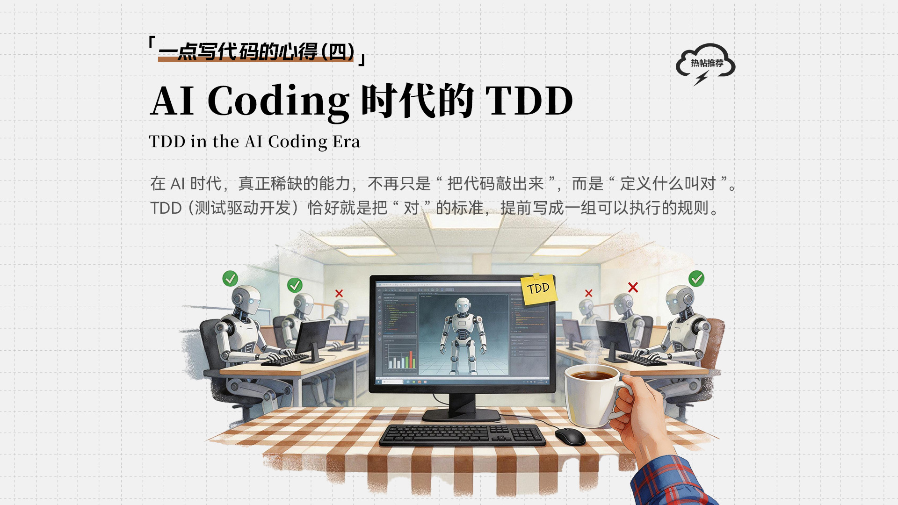
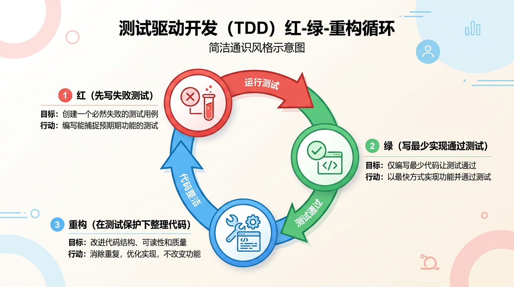
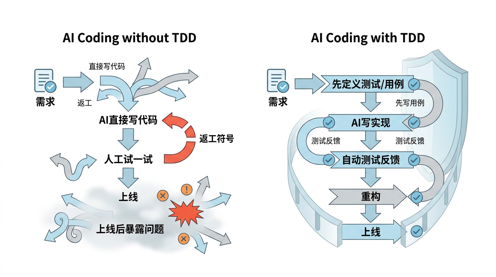
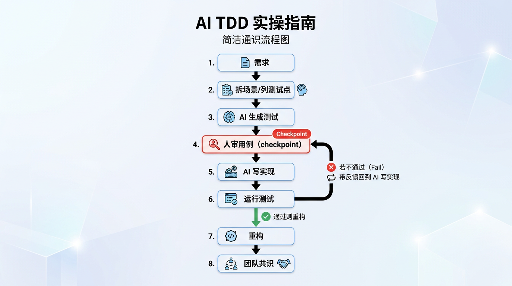
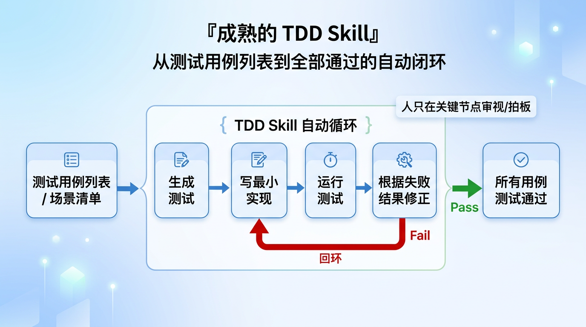

在前面文章[一点写代码的心得（一）：AI 时代Coding还重要吗？](https://www.chaspark.com/#/hotspots/1219001803137515520)里，我聊过一个看上去有些"逆潮流"的观点：AI 来了，Coding 不仅没有过时，反而更需要我们去理解它的本质。因为 AI 确实能帮我们更快地把代码"写出来"，那它能不能自动帮我们把代码"写对"呢，比如在代码质量要求特别高的领域，怎么去使用AI编程。

这是我最近越来越强烈的一个感受，在 AI Coding（AI 辅助编程）时代，代码生成的速度已经不再是瓶颈，真正的挑战变成了如何保障代码质量，包括准确性、可读性、系统可维护性，以及如何应对 AI "幻觉"。

我记得公司这些年在软件工程能力变革里，一直在推 TDD（测试驱动开发）这样的作业方式。软件特战队也好，软件 mini 也好，都在反复强调"先想清楚怎么验证，再动手实现"。只是过去很多团队一听 TDD 就头大，觉得这套方法门槛高、节奏慢、写起来麻烦，最后往往是道理都懂，落地很难。

但挺有意思的是，过去觉得"贵"的东西，到了 AI Coding 时代，反而变成了最合算的东西。

为什么TDD合适？我理解有两个关键点：

TDD 增加了 AI 动手前的 checkpoint。先把用例写出来，人可以在这一刻审视需求到底对不对、边界全不全、例外场景漏没漏。

TDD 给 AI 上了一把枷锁。AI 不是"差不多就行"，而是"必须把测试跑通"，这相当于给它设定了明确的出口条件。

说得再直白一点：在 AI 时代，真正稀缺的能力，不再只是"把代码敲出来"，而是"定义什么叫对"。TDD 恰好就是把"对"的标准，提前写成一组可以执行的规则。人负责定义标准，AI 负责在标准内实现，这两件事绑在一起，我觉得就是 AI Coding 时代很自然的一组搭档。不妨回想一下：你最近一次和 AI 协作写代码时，是先定了"对"的标准，还是直接让它出实现？

# 一、TDD 简介

TDD 这件事，说复杂也复杂，说简单也简单。

它最经典的节奏，其实就是三个词：红、绿、重构。

红：先写测试，让测试先失败。

绿：再写最少量的实现代码，让测试通过。

重构：在测试保护下，把代码整理得更干净、更优雅。

这套方法听起来有点"反直觉"。大多数人写代码的天然习惯是：先把功能做出来，再补测试。TDD 则反过来，它要求你先想清楚"什么样的行为算正确"，然后再去写实现。

为什么这件事重要？因为它逼着我们先想"做什么"，再想"怎么做"。

在讨论代码设计时，我常会提到"抽象与实现"、"分而治之"、"Trade-off"这些词。后来我越来越觉得，TDD 本质上也是一种很强的工程化思维训练。

先写测试，其实是在先定义边界。你会被迫思考：

这个函数到底解决什么问题？

正常场景是什么？

边界场景是什么？

异常输入怎么处理？

我希望未来别人怎么理解这段代码？

写下一个函数前，你会先问自己哪几条？很多代码之所以越写越乱，不是因为实现能力不够，而是因为一开始就没有把问题边界想清楚。于是写着写着，逻辑开始蔓延，职责开始漂移，最后一个函数既做校验，又做转换，还顺手查个库、打个日志、补个兜底。这样的代码当然也能跑，但它会像潮湿天气里的墙皮一样，迟早开始脱落。

而 TDD 的价值就在于，它天然逼着代码向"可测试"演化。可测试的代码，通常意味着职责更单一、依赖更少、边界更清晰。这和我一直强调的"分而治之"其实是同一件事。不是 TDD 神奇，而是任何一种要求你把行为说清楚的方法，最后都会倒逼设计变得更干净。

所以我现在看 TDD，不太把它当作一套"测试技巧"，而更愿意把它理解为一种先定义正确性，再组织实现的开发习惯。再回过头想一想，TDD逼着我们先想"做什么"，再想"怎么做"，AI 是不是正在替我们把"怎么做"这一步干了。

# 二、手动 TDD VS AI TDD

过去很多人对 TDD 有抵触，不是因为它没道理，而是因为它确实"贵"。

手动 TDD 最大的痛点是什么？是写测试很耗神。你得自己搭场景、补数据、写断言、补桩、跑失败、再改实现。对于很多赶进度的团队来说，这笔账很难算过来，于是大家很容易退回到熟悉的路径：先把功能写了再说。

但 AI 进来之后，这笔账变了。

| 维度 | 手动 TDD | AI TDD |
|---|---|---|
| 写测试成本 | 高，容易成为"不做"的理由 | 低，AI 可以快速生成用例骨架 |
| 写实现成本 | 人逐行去写 | AI 可以根据失败测试快速补实现 |
| 人的精力投入 | 花在"写代码"上较多 | 更聚焦在"审用例、定边界、判对错" |
| 坚持难度 | 容易半途而废 | 更容易形成稳定习惯 |

这也是为什么我越来越觉得，TDD 在过去更像一种纪律，在今天更像一种杠杆。

手动 TDD 时，人既要当设计师，又要当泥瓦匠，脑力和体力都很重；到了 AI TDD，人更多是在扮演"裁判"和"设计师"的角色。你先把规则定出来，再让 AI 去比赛。它写得快不快，不再是关键；它有没有按规则出牌，才是关键。

举个很小的例子：你要实现一个接口，以前得自己写测试、自己写实现，两边的"码字"都很费时；现在你可以先想清楚"这个接口在什么输入下该返回什么"，让 AI 生成测试代码，再让它根据测试写实现，你只负责审用例、看通过与否。同样是 TDD，节奏没变，但重活被 AI 扛走了。

总结成一句话：**人做最擅长的（定义正确性、边界与例外），AI 做最耗时的（写测试代码与实现代码）。**过去 TDD 让人望而却步，是因为"太费劲"；今天 AI 把费劲的部分接过去了，人只需把关键的判断留给自己。

# 三、AI Coding 使用 TDD VS 不使用 TDD

前面说的是"用 TDD 的话，人手写还是 AI 写"的差别；这一节要说的是另一件事：在 AI Coding 时，你到底用不用 TDD——两条路线，结果大不一样。

不用 TDD 的时候，AI Coding 像什么？像给一个效率很高、但有时会自作主张的实习生下任务。你说一句"帮我把这个功能做了"，它很快就做完了，看起来还像模像样。可等你一跑、一联调、一上线，问题就从各个角落冒出来了：边界漏测、AI 幻觉（代码看起来对、跑起来错）、改一处崩一处。返工次数一多，你会发现真正浪费的，不是编码时间，而是你来回确认、补漏、擦屁股的时间。

以上说的这个场景，有AI Coding经验的同学应该有感触，你让它不停的改，改到后面人跟AI都搞不清楚了，甚至要推倒重来。当然这个跟上下文长度有关，也有不同的解决方式。这里让AI一次性把代码写对，也是种解决措施。

用了 TDD 之后，工作方式就不一样了。你先写或审用例，再让 AI 写实现，用"测试通过与否"当出口；幻觉被测试拦住，回归有保障，行为也有文档。

在 AI Coding 场景下，TDD 能显著减少那种"看起来对，其实不对"的情况。下面用一个具体例子来说明。

假设你要做一个"优惠金额计算"的函数，规则并不复杂：

订单金额满 200 减 30；

会员再打 9 折；

最终金额不能小于 0；

如果订单金额本身就是负数，要直接报错。

如果不用 TDD，很多人的做法是：直接把规则丢给 AI，让它写实现。AI 大概率也真能很快给你一段看起来不错的代码，if-else 写得工工整整，变量名甚至比你起得还好。

但问题是，AI 很容易漏掉一些它觉得"不重要"的边角料。比如：

199.99 算不算满 200？

会员折扣是在减 30 之前打，还是之后打？

负数输入是返回 0，还是抛异常？

极端情况下优惠后出现负数，要不要兜底？

这些地方，AI 往往不是不会写，而是会擅自帮你做决定。这就是所谓的"幻觉"在工程里的一个具体表现：不是它编不出来，而是它可能编得很自信，但不是你真正想要的。

如果改成 TDD 呢？

你会先把这些场景写成测试：

普通用户 300 元订单，应该得到什么结果；

会员 300 元订单，应该得到什么结果；

199.99 元不能触发满减；

输入负数要抛异常；

优惠后金额最小不能小于 0。

这时候，你其实是在把含糊的需求，翻译成清晰的、可执行的规格说明。然后再让 AI 去写实现，它的发挥空间就会小很多。它依然可能第一次没写对，但没关系，测试会立刻把它拦下来。

这就是两种作业方式最大的不同：

不用 TDD：先相信 AI 写出来的东西，再靠人去补洞。

用 TDD：先把洞的位置圈出来，再让 AI 去填。

前者的问题在于，人总是在追着问题跑；后者的好处在于，问题会更早暴露，而且暴露得更具体。

从团队角度看，这种差异会被进一步放大。我常觉得，一个高效团队不是简单的人数相加，而是一个有共同语言、有默契的有机体。测试用例，其实就是软件团队的一种"共同语言"。它把很多原本靠口头解释、靠个人经验、靠上下文记忆的东西，沉淀成了人人看得懂、机器也跑得动的共识。

而一旦没有这种共识，AI 只会把团队里原本模糊的地方，放大得更快、更明显。

# 四、AI TDD 实操指南

说了这么多道理，还是回到"术"上来。

当然，TDD 不是银弹。原型阶段或一次性脚本不必强求；但代码一旦要进主干、要别人接手，就值得认真考虑。如果让我自己在业务里用 AI 做一次 TDD，我通常会按下面这个节奏来，不追求教科书式标准，追求的是简单、能落地、能坚持。

你们团队眼下卡在需求不清，还是测试难写？可以从最卡的那一步先试，不必六步一起上。

## 1、先别急着让 AI 写实现，先让它帮你"写清楚"

这是我现在最常用的一个动作。

拿到一个需求后，我不会第一时间说"帮我把代码写出来"。我会先让 AI 做两件事：

帮我拆场景；

帮我列测试点。

比如还是刚才那个优惠金额计算规则，我通常会先给 AI 这样一个指令：

> 不要先写实现。
> 请先根据下面的业务规则，列出测试场景，覆盖正常场景、边界场景和异常场景。
> 如果规则有歧义，请先指出，不要自行假设。

这一步特别重要，因为它把 AI 从"代码生成器"切换成了"需求澄清助手"。

很多时候，AI 真正的价值不在于写了多少行代码，而在于它会逼着你把原本说不清楚的地方说清楚。你会发现，真正模糊的往往不是代码，而是需求。

## 2、让 AI 先生成测试，再由人审测试

场景列出来之后，再让 AI 生成测试代码。

这时候我的要求通常会非常明确：

> 请只生成测试代码，不要写生产代码。
> 测试命名要能看出业务语义。
> 优先覆盖边界场景和异常场景。
> 如果你发现某条规则在测试层面无法表达，请指出原因。

这里有个关键动作，很多人容易省掉：**人要审测试，而不是直接相信测试。**

因为 AI 不光会在生产代码里"幻觉"，它在测试代码里一样会。它可能漏断言，可能把一个错误行为写成正确预期，也可能把场景拆得很漂亮，但避开了最难的边界。

所以这里的 checkpoint 一定要落在人身上。

我自己的习惯是，重点审三件事：

规则理解是否正确；

边界值是否覆盖；

断言是不是在验证真正重要的业务结果。

## 3、再让 AI 写"刚好够用"的实现

测试确认后，再让 AI 写实现。

这里我反而会刻意压制它"发挥"：

> 请根据现有测试写最小实现。
> 先以让测试通过为目标，不要过度设计。
> 如果你想新增抽象或提前扩展，请先说明理由。

我为什么会强调"不要过度设计"？因为 AI 其实很喜欢"一步到位"，它经常会在一个很小的问题上，顺手给你铺出三层抽象、四个类、五个接口，看起来很高级，维护起来很头大。这里其实就是在让AI在遵循KISS原则。

很多时候，真正的工程能力不在于堆多少模式，而在于能否用合适的复杂度解决合适的问题。TDD 的一个好处，就是它天然能抑制这种"想太多"。因为你只需要先把眼前这些测试跑通，而不是提前服务一个还没发生的未来。

## 4、把失败结果继续喂给 AI，让它在反馈中迭代

如果测试没有一次通过，不要急，这反而是正常情况。

AI TDD 很像带一个聪明但缺乏上下文的新人。你不能指望他第一次就完全写对，但你可以给他非常及时、非常具体的反馈。

所以我常做的一件事，就是把测试失败信息原样贴回去：

> 以下是失败测试结果，请不要重写全部代码。
> 只分析失败原因，并最小化修改实现，让这些测试通过。
> 同时解释你这次修改影响了哪些场景。

这个过程其实很像教练式沟通里的那种节奏：不要一上来就替对方把事全做了，而是给足够清晰的反馈，让它在反馈里收敛。

对 AI 来说也一样。最怕的是我们自己给的输入模糊，输出评价也模糊，最后还埋怨它"不靠谱"。很多时候，不是 AI 不行，而是我们没有建立一个好的反馈闭环。

## 5、最后再重构，把"这次做对"变成"下次也容易做对"

测试全绿之后，别急着收工。这个时候是最适合重构的。

因为此时你手里已经有了一张防护网，改动是相对安全的。你可以去做这些事：

重命名那些别扭的变量；

抽掉重复逻辑；

让函数职责更单一；

把容易漂移的业务规则收拢到一起。

这也是为什么我一直觉得，TDD 不是为了让你多写一堆测试，而是为了让你有底气去整理代码。

## 6、从个人习惯变成团队习惯

个人会用，不算真会；团队能稳定用，才算落地。

我比较认同一个说法：好的组织，不是大家都很努力，而是组织具备把个人经验转化为集体资产的能力。

放到 AI TDD 这件事上，我觉得最值得沉淀的，至少有三样东西：

一套稳定的 prompt 模板；

一组有代表性的测试样例；

一条大家默认遵守的开发规则：先想验证，再写实现。

再往前走一步，还可以把它变成团队共识：

新功能默认先列场景；

关键逻辑默认先补测试；

AI 生成的测试和实现都要过人工审视；

提交前默认跑测试，而不是"差不多就 merge"。

测试文化本质上是一种"我们如何工作"的认同感，而高质量测试用例，本身就是一种最有生命力的知识沉淀。

说到底，AI TDD 真正难的，不是工具，而是习惯；不是能力，而是共识。

# 五、成熟的TDD Skill

上面用一个详细的过程展开了AI TDD的流程，但要是开发过程中需要人工不断的去给AI喂Prompt，那效率也太低了。

好在可以让AI掌握TDD的skill，自动完成整个TDD流程的开发，流程变成了从一个测试用例列表出发，到所有用例测试通过，中间是TDD的开发流程。整体可以概括成下面这样：你先给出测试用例列表（或场景清单），AI 在 Skill 的约束下自动完成「写测试 → 写实现 → 运行测试 → 根据失败结果修正」的循环，直到全部用例通过；人只需要在关键节点做审视和拍板，而不必每一轮都亲手写 prompt。

**用什么样的 Skill？**核心是把前面几节里反复强调的 TDD 节奏，固化成一条 AI 会默认遵守的规则。例如：在接到需求或接口说明时，先不写实现，而是先列出测试场景并生成测试代码；在写实现时只做最小实现、不过度设计；在测试失败时根据失败信息做最小化修改并说明影响范围。把这些约定写进 Skill，AI 在每次对话中就会自动按这套节奏走，你不需要每次都重复"先写测试再写实现""不要过度设计"等指令。

**在 Cursor 里怎么用？**Cursor 支持把这类约定写成 Agent Skill。你可以建一个技能目录（例如项目内用 `.cursor/skills/tdd-workflow/`，或本机通用放在 `~/.cursor/skills/tdd-workflow/`），在里面放一个 SKILL.md，在开头的 description 里用一两句话说明：当用户要求实现功能、写接口、修 bug 时，默认按 TDD 流程执行——先列测试场景、生成测试代码，再写实现，测试失败则根据报错做最小修改。正文里用简洁的步骤写好"先写测试 / 最小实现 / 失败则最小修正"的 checklist，必要时加一两条示例指令或约束（如"不要一次写全功能，先让当前用例通过"）。保存后，在对话里提到"按 TDD 做""用 TDD 实现这个接口"或直接开始描述需求时，Agent 会优先应用这条 Skill，自动走「测试 → 实现 → 运行 → 修正」的闭环，你主要在关键节点审用例、看通过与否即可。

**用 Superpowers 插件做 TDD。**如果你主要用 Claude Code，可以配合官方插件 Superpowers（Anthropic 认证，由 Jesse Vincent 等人维护）把 TDD 直接"焊"进工作流。Superpowers 的设计就是约束 Claude 不要跳过设计、直接写实现，而是按「头脑风暴 → 写计划 → 按计划执行 → 评审」四步走；其中执行阶段会强制红-绿-重构：先写测试并让测试失败，再写实现，若在失败测试之前就写了生产代码，会被要求删掉重来。

# 六、总结

写到这里，我越来越觉得，TDD 在 AI Coding 时代的重要性，不是因为它多时髦，而是因为它刚好补上了 AI 最容易失控的那个环节。

AI 最大的优点是快，最大的风险也是快。它能在几分钟里给你产出一大段像模像样的代码，也能在几分钟里把一个原本含糊的小问题，放大成一堆难以收拾的返工。

所以问题从来不是"要不要用 AI"，而是"我们拿什么去约束 AI"。

我越来越相信，未来真正高效的作业方式，不是人和 AI 比谁写得快，而是人和 AI 分工越来越清晰：

人定义正确性；

人识别边界；

人做权衡；

AI 负责把实现快速铺开；

测试负责守住底线。

这其实也呼应了在[第一篇文章](https://www.chaspark.com/#/hotspots/1219001803137515520)里说的那个意思：Coding 的价值，从来不只是"翻译语法"，而是对现实问题进行抽象、约束和权衡。

过去没有 AI 的时候，我们总觉得 TDD 太重；今天有了 AI，我反而觉得 TDD 终于等到了最适合它的时代。因为测试这件事，第一次不再只是"额外负担"，而开始变成一种高回报的投资。

在 AI 写代码越来越快的今天，谁掌握"什么叫对"的标尺，谁才真正掌握质量。

而 TDD，恰好就是这把标尺。在你当前的项目里，哪一块最适合先用 TDD 拴住 AI？不妨想一想。

---

**系列文章：**

- [一点写代码的心得：AI 时代 Coding 还重要吗？](https://www.chaspark.com/#/hotspots/1219001803137515520)
- [一点写代码的心得（二）：程序员的书单](https://www.chaspark.com/#/hotspots/1219726367812329472)
- [一点写代码的心得（三）："你可别再重构了！"](https://www.chaspark.com/#/hotspots/1229662331782266880)
- [一点写代码的心得（四）：AI Coding 时代的 TDD](https://www.chaspark.com/#/hotspots/1252423588898463744)
- [一点写代码的心得（五）：AI Coding 时代的软件工程](https://www.chaspark.com/#/hotspots/1265481751727812608)
